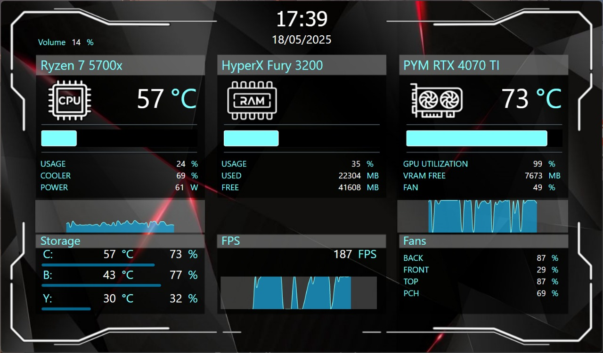

# Dravus Sensor Panel

Welcome to the **open source** solution to build amazing Sensor Panels!

:warning: The App is in alpha version. Bugs may happen. :warning:

## Features

- Much info extracted using [Libre Hardware Monitor](https://github.com/LibreHardwareMonitor/LibreHardwareMonitor)
- FPS extracted from [RivaTuner Statistics Server (RTSS)](https://www.guru3d.com/page/rivatuner-rtss-homepage/)
- Line charts
- Bar charts
- Unit of measurement conversion
- [Nice already made panels](https://github.com/topics/dravus-sensor-panel) that you can download and import!
- **Free**

## Not supported yet :weary:

- Gauge (Coming soon :clock10:)
- Linux/MacOS (Theoretically, it works, but I haven't had the opportunity to test it yet.)

## Download
You can download the latest release [here](https://github.com/ynixt/dravus-sensor-panel/releases).

## Contribute

Want to contribute? You are more than welcome :satisfied:

Did you find a bug? Please open an issue.

Do you want to open a PR? Nice! Our current stack is:
- dotnet 8.0
- [Avalonia 11](https://github.com/AvaloniaUI/Avalonia)

Enjoy!

## Screenshots

